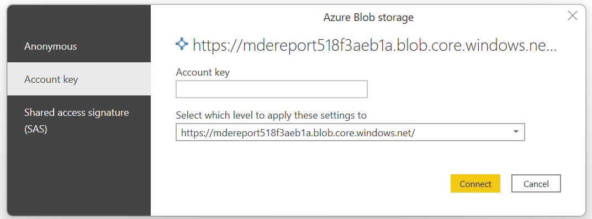

# Microsoft 365 Defender Insights Report
## Table of Contents
1. Introduction
2. Features
3. Prerequisites
4. Data Sources
5. Setup
6. Data Collection
7. Viewing the PowerBI Report
8. Publishing the PowerBI report
## 1. Introduction
The Defender Insights Report is a solution that leverages PowerShell, Azure Automation, Storage and PowerBI to gain additional insights into the vulnerabilities, security recommendations and general health of devices onboarded into Defender for Endpoint. This project provides a customisable framework to the community, allowing you to build on the key security metrics used by customers throughout their daily operations.
#### Usage Disclaimer
        ############################################################################
        This sample script is not supported under any Microsoft standard support program or service. 
        This sample script is provided AS IS without warranty of any kind. 
        Microsoft further disclaims all implied warranties including, without limitation, any implied 
        warranties of merchantability or of fitness for a particular purpose. The entire risk arising 
        out of the use or performance of the sample script and documentation remains with you. In no
        event shall Microsoft, its authors, or anyone else involved in the creation, production, or 
        delivery of the scripts be liable for any damages whatsoever (including, without limitation, 
        damages for loss of business profits, business interruption, loss of business information, 
        or other pecuniary loss) arising out of the use of or inability to use the sample script or
        documentation, even if Microsoft has been advised of the possibility of such damages.
        ############################################################################   

## 2. Features
### Current Release
The first release of the PowerBI insights report contains insights into (but not limited to) the following areas:
* Device summary
    * Onboarded devices and information including operating systems, domains, AV status, summarized vulnerability status
* Device lookup
    * Provides device lookup capability for a single consolidated view of all applicable vulnerabilities, security recommendations, exploitability assessment and software inventory specific to a selected machine
* Vulnerability summary
    * Provides situational awareness of the vulnerability state across your environment. Includes metrics around total vulnerability percentage, vulnerability state by CVE severity, CVEs by software and vendor, as well as breakdown of CVEs by device type
* Vulnerability detail
    * More granular information specific to CVEs present in the environment. CVE breakdown by severity, top 10 exposed devices, and most vulnerable software. This includes a data table, where information can be filtered and exported for further analysis or provided to relevant teams for remediation.
* Vulnerability lookup
    * The CVE lookup page allows a user to search for a specific CVE, which returns a vulnerability impact assessment across onboarded devices. It includes impacted software, domains, operating systems in addition to direct links to any applicable exploits that may exist for the selected CVE. CVE reference data is also provided, based on what was sent to MITRE on CVE submission.

#### Screenshots

### Coming Soon
While software inventory and security configuration datasets are collected and loaded as part of the data collection module, the PowerBI pages are under development and have not yet been released.

The next release will include:
* Software inventory assessments
    * Insights into the different software and versions used across onboarded devices
* Security configuration assessments
    * Analysis of security recommendations and device applicability
* Enhanced Defender AV information
    * Enhanced view of of Defender anti-virus status across onboarded devices. This will include signature versions, AV scan information and coverage status
* CVSS data
    * Deeper insights into the raw CVSS data based on vulnerabilities reported in your environment. 
* Script improvements
    * Better error handling to come

## 3. Prerequisites
To benefit from the full functionality of the Defender Insights Report, the following is required:
 
* Microsoft 365 E5 or Defender for Endpoint P2 licensing
    * Required for the collection of the endpoint data used within the solution
* An active Azure subscription
    * An Azure Storage Account, Automation Account and Key Vault are used for different purposes throughout the project
* PowerBI desktop
    * Required to create, modify, and publish the report
* An Azure AD Application Registration
  * Provides the relevant permissions to download the required data. A setup script has been provided to setup the app registration
* PowerShell 7
  * The data collection scripts have only been tested on PowerShell 7

## 4. Data Sources
Below are the specific data sources used by the insights report. The Microsoft 365 Defender API makes available a significant amount of information through its various endpoints; the CVE feed by NIST is used for the CVSS data.

### NIST National Vulnerability Database
### [CVE Feed](https://nvd.nist.gov/vuln/data-feeds#APIS)
This data feed allows us to granularly analyse CVE and CVSS data. For this report, it provides a supplementary data feed of granular CVSS data in addition to that already provided by Defender for Endpoint. 

### Microsoft 365 Defender API endpoints
The data collection module can pull vulnerability, security configuration and software inventory assessment data in two distinct ways, as supported by the relevant API endpoints. 

1.	OData endpoint using pagination
2.	Bulk export of compressed files

Both options download every unique combination of its relevant dataset. For example, the vulnerabilities endpoint will return a record for each unique vulnerability applicable to each device onboarded to Defender. 

While official documentation suggests bulk export should occur for environments with more than 100k devices, my recommendation is to choose this option where you have more than 10k devices. 
The bulk export option gives us flexibility to download all required data quickly and efficiently without impacting tenant API limitations. As such, this is the recommended method when using the data collection module.

#### [Vulnerabilities](https://docs.microsoft.com/en-us/microsoft-365/security/defender-endpoint/get-assessment-software-vulnerabilities?view=o365-worldwide)
The vulnerability endpoints return a record for every device vulnerability combination. The data is downloaded, compressed, and used by PowerBI to understand the overall environment vulnerability state. In addition, it allows us to granularly report on vulnerable devices, device groups or perform impact assessments based on a specific CVE.
1.	[Vulnerabilities via OData pagination](https://docs.microsoft.com/en-us/microsoft-365/security/defender-endpoint/get-assessment-software-vulnerabilities?view=o365-worldwide#1-export-software-vulnerabilities-assessment-json-response)
2.	[Bulk export of compressed files](https://docs.microsoft.com/en-us/microsoft-365/security/defender-endpoint/get-assessment-software-vulnerabilities?view=o365-worldwide#2-export-software-vulnerabilities-assessment-via-files)

#### [Software Inventory](https://docs.microsoft.com/en-us/microsoft-365/security/defender-endpoint/get-assessment-software-inventory)
Returns a record for each installed software for on each machine onboarded to MDE.  
1.	[Software inventory assessment via OData pagination](https://docs.microsoft.com/en-us/microsoft-365/security/defender-endpoint/get-assessment-software-vulnerabilities?view=o365-worldwide#1-export-software-vulnerabilities-assessment-json-response)
2.	[Bulk export of compressed files](https://docs.microsoft.com/en-us/microsoft-365/security/defender-endpoint/get-assessment-software-vulnerabilities?view=o365-worldwide#2-export-software-vulnerabilities-assessment-via-files)

#### [Security Configuration](https://docs.microsoft.com/en-us/microsoft-365/security/defender-endpoint/get-assessment-secure-config)
Returns a record for each security recommendation per device. Examples might include the deployment/configuration status of LAPS for each supported device. We use this information to provide situational awareness on controls that are confirmed to increase the overall security posture of your enterprise.
1.	[Security recommendations via OData pagination](https://docs.microsoft.com/en-us/microsoft-365/security/defender-endpoint/get-assessment-secure-config?view=o365-worldwide#1-export-secure-configuration-assessment-json-response)
2.	[Bulk export of compressed files](https://docs.microsoft.com/en-us/microsoft-365/security/defender-endpoint/get-assessment-secure-config?view=o365-worldwide#2-export-secure-configuration-assessment-via-files)

#### [Machines](https://docs.microsoft.com/en-us/microsoft-365/security/defender-endpoint/get-machines?view=o365-worldwide)
We pull a list of all devices in Defender for Endpoint; this includes onboarded and discovered devices. Leveraging the concept of a PowerBI star schema, this dataset forms a core fact table of the PowerBI report.

#### [Device Health](https://docs.microsoft.com/en-us/microsoft-365/security/defender-endpoint/device-health-export-antivirus-health-report-api)
Leveraging the Device AV health report endpoint, we gain deeper visibility into the Defender AV status of each respective machine.

### Data Collection Workflow
The workflow to collect data leverages several functions within the PowerShell module. At a high level, it is:
1.	Download and parse CVE data from NIST NVD API
2.	Download onboarded device data
3.	Download device vulnerabilities
4.	Download device software inventory
5.	Download device security recommendations
6.	Download extended device anti-virus data 
7.	Upload collected/parsed data to a secured Azure Storage account container

The size of your environment will dictate how long data collection takes. In testing, execution took approximately 20 minutes for an environment of 50k devices. When execution has finished, the required files will be placed into a folder titled ‘output’. The content will then be uploaded to a secured Azure storage container.

## 5. Setup
#### Azure Infrastructure
1.	Run the setup script with the <code>-Azure</code> switch. This will provision the core requirements:
    * Resource group
    * Storage account
      * Storage container
    * Automation account
    * Key vault

##### Execute:
<code>.\Setup.ps1 -Azure -ResourceGroupName MDEPBI -Location australiaeast</code>

##### Output:
        Provisioning | Resource Group: MDEReport
        Provisioning | Storage Account: mdereport02fd4aa67d
        Provisioning | Storage Container: data
        Provisioning | Automation Account: MDEReport02fd4aa67d
        Provisioning | Key Vault: MDEReport02fd4aa67d
        Provisioning | Key Vault: StorageAccountKey secret stored

If the Key Vault is provisioned successfully the storage account key will be stored in the Key Vault under the name <code>StorageAccountKey</code>. Otherwise, the key will be returned to the console and you will need to manually add it to the key vault. If you wish to setup your environment manually, you will find the requirements in the setup script.

#### Azure AD App Registration
An app registration is required to allow for authenticated access to the Microsoft 365 Defender API. The provided setup script will automatically provision the app with required API access, and store the app secret in the provisioned Key Vault. If for whatever reason you need to setup the app manually, the permissions can be found below. This is a read only app registration. 

| Azure AD API Name  | Permission  |  Type |
|---|---|---|
|  Microsoft Graph | User.Read | Delegated |
|  Microsoft Threat Protection | Incident.Read.All |Application|
|  WindowsDefenderATP | Alert.Read.All |Application|
|  WindowsDefenderATP | File.Read.All |Application|
|  WindowsDefenderATP | Ip.Read.All |Application|
|  WindowsDefenderATP | Machine.Read.All |Application|
|  WindowsDefenderATP | RemediationTasks.Read.All |Application|
|  WindowsDefenderATP | Score.Read.All |Application|
|  WindowsDefenderATP | SecurityBaselinesAssessment.Read.All |Application|
|  WindowsDefenderATP | SecurityConfiguration.Read.All  |Application|
|  WindowsDefenderATP | SecurityRecommendation.Read.All |Application|
|  WindowsDefenderATP | Software.Read.All |Application|
|  WindowsDefenderATP | Ti.Read.All |Application|
|  WindowsDefenderATP | Url.Read.All |Application|
|  WindowsDefenderATP | User.Read.All |Application|
|  WindowsDefenderATP | Vulnerability.Read.All |Application|

##### Execute:
Initial setup will require a [high level of access](https://learn.microsoft.com/en-us/azure/active-directory/manage-apps/grant-admin-consent#prerequisites) such as global admin to complete.

<code>.\Setup.ps1 -AppRegistration -ResourceGroupName MDEPBI -Location australiaeast</code>

##### Output:
        Provisioning | Azure Application Registration: MDE PowerBI API
        Provisioning | Azure Application Secret
        Provisioning | Admin Consent for: MDE PowerBI API. This will take 30 seconds.
        Tenant ID: f1f5a2d3-4e98-4867-827c-365a22b18a04
        App ID: e078504b-9e4d-407b-9c99-08b2fe5cf3e3
        App Secret: Stored in Key Vault MDEReport518f3aeb1a

If you use the ResourceGroupName from the first step, the app secret will be stored in the provisioned Key Vault. Otherwise, you will need to manually add the returned app secret into Key Vault with the name <code>AppSecret</code>.

## 6. Data Collection
The data collection can be run manually on your local workstation, or automatically through Azure Automation.

One of the success criteria for this project was to facilitate the automated collection of the required datasets. Using Azure Automation, you can schedule daily PowerShell runbooks to execute the project’s data collection module. The default Azure Automation sandbox is not designed to provide the memory or processing power required to collect and parse the data. To achieve full automation you must leverage Azure Automation’s hybrid worker functionality.

The only key difference between running the PowerShell script locally vs in Azure Automation is the requirement to provision a virtual machine in Azure, or use a local VM connected via Azure Arc. The creation of the VM is not covered in this setup guide, however Azure hybrid worker configuration is. Should you wish to automatically update the PowerBI report using the scheduled refresh functionality, you will need to run this using Azure Automation or come up with an automated solution that fits your needs.

#### Local Data Collection
##### Execute:
1. Modify <code>Collect.ps1</code> with your tenant specific details per the setup script output. These are marked with <code>CHANGE ME</code>.
2. Import the PowerShell module
<code>Import-Module MD.psm1</code>  
1. Run the collection script with the <code>-Local</code> switch
<code>.\Collect.ps1 -Local</code>

##### Output:
        Processing: Device Information
        Processing: Device Vulnerabilities
        Processing: Software Inventory
        Processing: Security Configuration
        Processing: Defender AV Information
        Processing: Security Baselines
        Processing: Uploading content to storage container

The results will be uploaded to the storage container and stored locally in the <code>\Output</code> folder, based on the <code>$Path</code> location in the collection script. 

#### Azure Data Collection
Data collection in Azure is subtly more complex due to the requirement of using Azure Automation Hybrid Workers. 
##### Execute:
1. Provision a fresh Windows Server 2022 VM in Azure (Windows 10 and Arc connected servers should work but have not been tested).
   * Recommended specs: 2x vCPU / 16GB RAM / 128GB+ system drive 
2. Ensure managed system identities is enabled on the VM. Copy the principal ID as you will need this shortly.

3. Click add role assignments, you will need to scope the Automation Contributor role to the resource group that contains the Automation Account created by the setup script. 

1. Enable system managed identities for the Automation Account created by the setup script. Copy the principal ID as it is required for the next step
2. Open the Key Vault > Access Policies > Create. Choose “key & secret management” from the drop down. Select next and enter the principal ID of the automation account. Click Finish.
3. Navigate to the Automation Account > User Hybrid Worker Groups > Create. Enter a name, select default for hybrid worker credentials, click next. Choose the VM you created in step 2. Click Finish.

7. Navigate to Runbooks > Create a new PowerShell 5 runbook called “Setup-Hybrid-Worker”
8. Copy the code from script “Setup-Hybrid-Worker.ps1”. Save the runbook and publish it. Once saved, start the runbook ensuring “run settings” is set to the hybrid worker group you created. Observe for any errors and when the job completes successfully, restart the VM.

9.	Create a new runbook with a name of your choosing, ensuring to select PowerShell runtime version 7.

10.  Copy the data collection code from the corresponding file <code>Collect.ps1</code>. Modify <code>Collect.ps1</code> with your tenant specific details per the setup script output. These are marked with <code>CHANGE ME</code>.
11. Publish the changes and start the runbook targeting the hybrid worker group you created in step 6.
12. When the job has completed successfully, you should see several files uploaded to your storage account under the data container. You should also see these in the <code>\Output</code> folder on the hybrid worker.

## 7. Viewing the PowerBI Report
When the data has been successfully uploaded to the Azure storage container, you can proceed with generating the PowerBI report. 

1. Open the PowerBI template file <code>Microsoft 365 Defender_v1.0.pbit</code>. You will be prompted to fill in the storage container name, followed by the storage account name. You will then be prompted for the storage account key; you will need to retrieve this from the Key Vault. Click connect.

2. Data will now start loading in PowerBI. Depending on the size of your environment, this may take a while. It’s time for another coffee!

#### Some notes on PowerBI
To optimise cost, performance and support use in larger environments, the decision was made to use data compression for the core datasets. During testing it took approximately 30-40 minutes to load 3GB~ of compressed data into PowerBI. While this may seem like an abnormal amount of time, the data compression ratio observed was approximately 35:1. When attempting to ingest the raw uncompressed data, PowerBI limitations were exceeded. PowerBI can natively read the compressed data without the requirement to decompress the respective file first. 

While not covered in this setup guide, it is worth noting PowerBI allows for both [row-level security (RLS)](https://docs.microsoft.com/en-us/power-bi/enterprise/service-admin-rls) in addition to granular [PowerBI workspace access](https://docs.microsoft.com/en-us/power-bi/collaborate-share/service-roles-new-workspaces) which can be further used to lock down access to your reports.

## 8. Publishing the PowerBI Report
TBC
